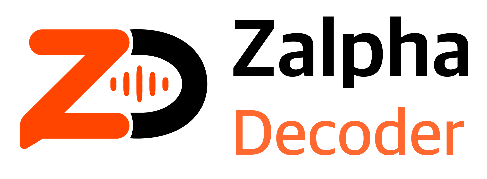
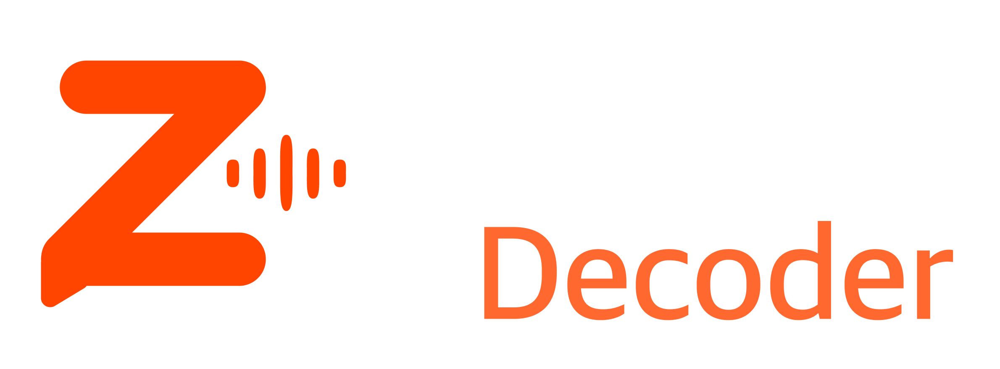

# Zalpha Decoder

Zalpha Decoder is a Storyboard-based UIKit iOS app that decodes slang, idioms, and short expressions into clearer style-aware translations.

AI responses are implemented with Firebase AI Logic and Gemini. The app also stores local decode history and saved target-language expressions for later review.

## Features

- Decode short text with Firebase AI Logic + Gemini
- Source language: `Auto`, `English`, `한국어`, `Japanese`, `Spanish`, `Russian`
- Target language: `English`, `한국어`, `Japanese`, `Spanish`, `Russian`
- Style selection: `Formal`, `Plain`, `Zalpha`
- AI-generated notes for meaningful slang, idioms, meme expressions, abbreviations, and culturally loaded phrases
- Local History screen with decode details
- Saved Slangs screen with search, detail view, generated examples, copy, and delete actions
- One-at-a-time example generation for saved expressions
- 100-character input limit
- Copy and toast feedback
- Light and dark mode UI support
- Light and dark app icon variants

## Screenshots

| Light | Dark |
| --- | --- |
|  |  |

Additional History and Saved Slangs screenshots can be added later if needed.

## Tech Stack

- Swift
- UIKit
- Storyboard
- Firebase Core
- Firebase AI Logic
- Gemini Developer API

## Project Structure

```text
ZalphaDecoder/
  AIService.swift                         # Prompt, Gemini request, and response parsing coordinator
  FirebaseAITextClient.swift              # Firebase AI Logic client
  AIServicePromptBuilder.swift            # Decode and example-generation prompts
  AIServiceResponseParser.swift           # JSON response parsing
  DecodeLanguage.swift                    # Supported language options
  TranslationStyle.swift                  # Formal, Plain, Zalpha styles
  ViewController.swift                    # Main decode screen
  HistoryViewController.swift             # Local decode history list
  HistoryDetailViewController.swift       # Decode detail and notes
  SavedSlangsViewController.swift         # Saved slang list and search
  SavedSlangDetailViewController.swift    # Saved slang detail and examples
  Base.lproj/Main.storyboard              # Main storyboard UI
  Assets.xcassets/                        # App assets and app icons
```

## Firebase Setup

This project requires a local Firebase config file:

```text
ZalphaDecoder/GoogleService-Info.plist
```

Do not commit the real `GoogleService-Info.plist`. Use `ZalphaDecoder/GoogleService-Info.example.plist` as a reference, then download the real file from Firebase Console.

Firebase AI Logic must be enabled in Firebase Console and configured for Gemini.

## Build

Open `ZalphaDecoder.xcodeproj` in Xcode, add your local `GoogleService-Info.plist`, then build and run the `ZalphaDecoder` scheme.
